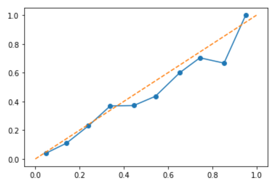
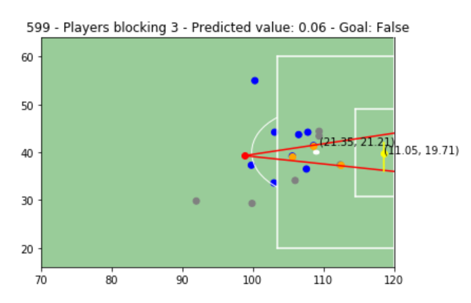
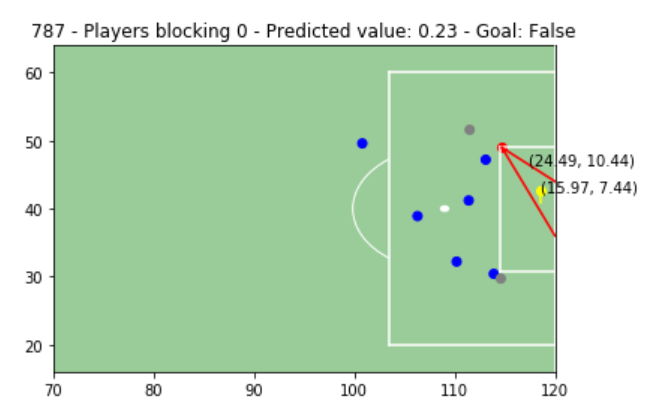

# Goal Expectation Model
This notebook shows how we can calculate the xG (goal expectation) metric for football.

## The calibration curve of the model

## Examples of the probability calculated for the model

